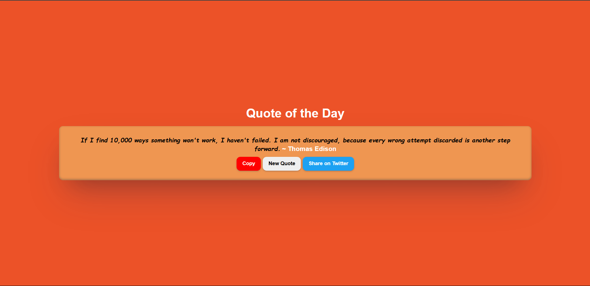

# Quote of the Day Web App

## Description
This is a web app that displays a random "Quote of the Day," allowing users to:
- Copy the quote to their clipboard.
- Share the quote on Twitter.

It has a clean and responsive design, fetching quotes from an external API.

## Tech Stack
- **HTML**: For structure and content.
- **CSS**: For styling and layout.
- **JavaScript**: For functionality (fetching quotes, copying to clipboard, and sharing on Twitter).
- **API**: [FreeAPI Quotes](http://api.freeapi.app/api/v1/public/quotes/quote/random) to fetch random quotes.

## Features
- **Random Quote Generator**: Fetches a random quote and displays it on the page.
- **Copy Quote**: Allows users to copy the displayed quote to their clipboard.
- **Share on Twitter**: Allows users to share the displayed quote directly on Twitter.

## Live Demo
You can see the live demo here: [Live Demo](https://chaicode-quote-of-the-day.vercel.app/)

## Screenshot

